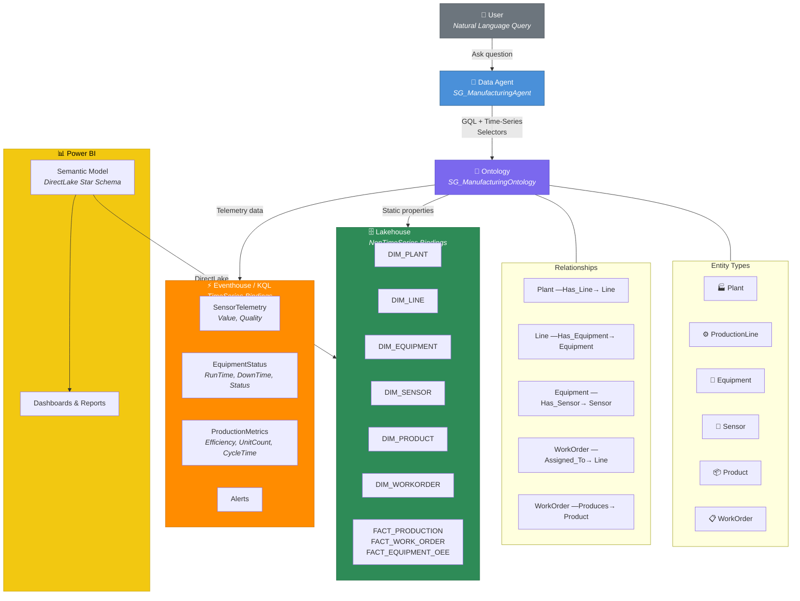

# Microsoft Fabric RTI Ontology Accelerator

A production-ready accelerator for deploying **Microsoft Fabric Real-Time Intelligence Ontologies** with Data Agents, KQL telemetry, and Power BI semantic models.


## 🎯 What This Accelerator Does

This accelerator deploys a complete **Digital Twin** solution on Microsoft Fabric:

| Component | Description |
|-----------|-------------|
| **Ontology** | 6 entity types (Plant, Line, Equipment, Sensor, Product, WorkOrder) with relationships and data bindings |
| **Lakehouse** | 9 Delta tables (6 dimensions + 3 fact tables) for master data |
| **Eventhouse** | 4 KQL tables for real-time telemetry (sensors, status, metrics, alerts) |
| **Semantic Model** | DirectLake star schema with 15 relationships and 15 DAX measures |
| **Data Agent** | AI-powered natural language queries over the ontology |

**Included Sample Domain**: Saint-Gobain Manufacturing (Glass & Building Materials)

## 🏗️ Architecture



> **Key insight**: The Data Agent queries **only the Ontology**. The ontology's data bindings transparently route static property queries to the Lakehouse and time-series queries to the Eventhouse/KQL — the agent never accesses these sources directly.

---

## 📋 Prerequisites

- **PowerShell 7+**: `winget install Microsoft.PowerShell`
- **Python 3.11+**: `winget install Python.Python.3.11`
- **Azure CLI**: `winget install Microsoft.AzureCLI`
- **Fabric Capacity**: Access to a Microsoft Fabric capacity (F-SKU or P-SKU)
- **VS Code with Copilot** (for spec-kit workflow): GitHub Copilot extension installed

---

## 🚀 Option 1: Deploy Existing Ontology (Script-Based)

The fastest way to deploy the complete Saint-Gobain Manufacturing Ontology.

### Step 1: Configure Your Environment

```powershell
# Clone the repository
git clone https://github.com/YOUR-ORG/Ontology-Manuf.git
cd Ontology-Manuf

# Login to Azure
az login

# Update capacity name in config (if different from 'msfabric001')
$config = Get-Content ontologies/SaintGobain/config.json | ConvertFrom-Json
$config.capacity.name = "your-capacity-name"
$config | ConvertTo-Json -Depth 10 | Set-Content ontologies/SaintGobain/config.json
```

### Step 2: Deploy Everything

```powershell
# Deploy all components (infrastructure → data → KQL → ontology)
.\Deploy-Ontology.ps1
```

Or deploy step-by-step:

```powershell
# Step 1: Infrastructure (workspace, lakehouse, eventhouse)
.\Deploy-Ontology.ps1 -StepInfrastructure

# Step 2: Load sample master data into Lakehouse
.\Deploy-Ontology.ps1 -StepData

# Step 3: Create KQL telemetry tables
.\Deploy-Ontology.ps1 -StepKqlTables

# Step 4: Deploy ontology model
.\Deploy-Ontology.ps1 -StepOntology

# Step 5: Deploy semantic model (optional — for Power BI dashboards)
.\Deploy-Ontology.ps1 -StepSemanticModel

# Step 6: Ingest sample telemetry into KQL (24h of data)
python deploy/ingest_sample_telemetry.py

# Step 7: Deploy Data Agent (ontology-only source with AI instructions)
python deploy/deploy_data_agent.py
```

### Step 3: Test the Deployment

Open the **Data Agent** in Fabric Portal and ask:

```
"Which production lines does the Aachen plant have?"

"For each plant, show any equipment that ever had a downtime greater than 150 minutes."

"For each plant, show any sensors on its equipment that ever recorded a temperature above 1100 degrees."

"How many pieces of equipment does each plant have?"

"List all sensors attached to the Float Bath equipment."
```

Or validate programmatically:

```powershell
# Inspect the deployed agent definition
python tools/inspect_agent.py

# Verify KQL data is clean (no embedded quotes)
python tools/check_timestamps.py

# Run full deployment validation
python tools/validate_deployment.py
```

---

## 🛠️ Option 2: Deploy Using Spec-Kit (Agent-Assisted)

A fully agent-driven workflow: install tooling, review specs, plan, and deploy — all via VS Code Copilot Chat prompts.

### Step 0: Install Prerequisites (one-time)

Open a terminal and install the required tools:

```powershell
# Install Python dependencies
pip install azure-identity

# Login to Azure
az login
```

### Step 1: Install Spec-Kit

In VS Code Copilot Chat, run:

```
Install spec-kit for this project. Run the command:
pip install spec-kit
Then run: specify init --here --integration copilot --script ps
This will scaffold the .specify/ folder, .github/agents/, and .github/prompts/ folders.
```

> **Note**: This repository already ships with spec-kit configured (`.specify/`, `.github/agents/`, `.github/prompts/`). If the folders exist, skip this step.

### Step 2: Enable Fabric Agent Mode

Switch to the Fabric agent for Fabric-specific operations. In VS Code Copilot Chat, click the agent selector (or type `@`) and select **Fabric**:

```
@Fabric Hello! Verify you can access my Fabric workspaces.
List all workspaces I have access to.
```

> **Tip**: The `@Fabric` agent has built-in knowledge of Fabric APIs, OneLake, KQL, and ontologies. Use it for workspace operations, item creation, and data queries.

### Step 3: Install Fabric MCP Server (enhanced capabilities)

The Fabric MCP Server provides additional tools for direct API access. In VS Code Copilot Chat:

```
@Fabric Install the Fabric MCP Server VS Code extension.
Run: code --install-extension fabric.vscode-fabric-mcp-server
Then verify it's running via Command Palette → "MCP: List Servers".
```

### Step 4: Install Semantic Model MCP Server (optional — for Power BI)

```
Install the Power BI semantic model MCP extension.
Run: code --install-extension analysis-services-tabular.powerbi-model
Then verify via Command Palette → "MCP: List Servers".
```

### Step 5: Configure Capacity

Use the Fabric agent to update your capacity:

```
@Fabric Read ontologies/SaintGobain/config.json and update the capacity.name 
to match my Fabric capacity. My capacity name is: [YOUR-CAPACITY-NAME]
```

### Step 6: Review the Constitution

```
@speckit.constitution Review the existing constitution at .specify/memory/constitution.md and confirm 
it reflects our current architecture: Fabric RTI Ontology with Lakehouse master data, KQL telemetry, 
and ontology-centric Data Agent.
```

### Step 7: Review the Specification

```
@speckit.specify Review the existing specification at specs/001-ontology-e2e/spec.md. 
Summarize the 9 user stories and confirm they cover: infrastructure, master data, KQL tables, 
ontology deployment, semantic model, telemetry ingestion, and Data Agent configuration.
```

### Step 8: Generate Implementation Plan

```
@speckit.plan Based on specs/001-ontology-e2e/spec.md, create or update the implementation plan 
at specs/001-ontology-e2e/plan.md. Include all deployment phases from infrastructure to Data Agent.
```

### Step 9: Generate Implementation Tasks

```
@speckit.tasks Based on specs/001-ontology-e2e/plan.md, generate implementation tasks at 
specs/001-ontology-e2e/tasks.md. Each task should map to a deployment script or Python command.
```

### Step 10: Execute the Tasks

```
@speckit.implement Execute the tasks in specs/001-ontology-e2e/tasks.md. 
Start with T101 (infrastructure) and proceed through all phases.
Run the PowerShell and Python deployment scripts via terminal.
Confirm each step completes before moving to the next.
```

### Step 11: Verify with Fabric Agent

Use the Fabric agent to verify deployed resources:

```
@Fabric List all items in my workspace "SG-Manufacturing-Ontology". 
Show me the lakehouse tables, KQL tables, and ontology item.
```

You can also query KQL data directly:

```
@Fabric Query my KQL database "SG_ManufacturingEventhouse":
SensorTelemetry | summarize count() by SensorId | top 10 by count_
```

### Step 12: Validate the Deployment

```
@speckit.analyze Perform a cross-artifact consistency check. Verify that all tasks in tasks.md 
are marked complete, all acceptance criteria in spec.md are satisfied, and the deployed resources 
match the plan.md design decisions.
```

### Step 13: Test the Data Agent

Open the **Data Agent** in Fabric Portal and test with the queries from [Step 3 in Option 1](#step-3-test-the-deployment).

---

## 🆕 Option 3: Create a New Ontology Project from Scratch

A complete agent-driven workflow to create a new ontology for **your own domain**, using the SaintGobain example as a reference. Every step is a Copilot Chat prompt.

### Phase 0: Environment Setup

#### 0.1 — Install Spec-Kit

```
Install spec-kit for this project. Run the following commands:
pip install spec-kit
specify init --here --integration copilot --script ps
This will create the .specify/ folder, .github/agents/ and .github/prompts/ folders 
with all the spec-kit agent definitions.
```

#### 0.2 — Enable Fabric Agent Mode

Switch to the Fabric agent for Fabric-specific operations:

```
@Fabric Hello! Verify you can access my Fabric workspaces.
List all workspaces I have access to.
```

> **Tip**: The `@Fabric` agent has built-in knowledge of Fabric APIs, OneLake, KQL, and ontologies. Use it for workspace operations, item creation, and data queries throughout this workflow.

#### 0.3 — Install Fabric MCP Server (enhanced capabilities)

```
@Fabric Install the Fabric MCP Server extension for VS Code.
Run: code --install-extension fabric.vscode-fabric-mcp-server
Then open Command Palette → "MCP: List Servers" to verify it's running.
```

#### 0.4 — Install Semantic Model MCP (optional — for Power BI)

```
Install the Power BI semantic model MCP extension for VS Code.
Run: code --install-extension analysis-services-tabular.powerbi-model
```

#### 0.5 — Azure Login

```
Run in terminal: az login
Verify I'm authenticated and have access to my Fabric capacity.
```

### Phase 1: Foundation — Create Constitution

```
@speckit.constitution Create a new constitution for my [YOUR DOMAIN] ontology project. 
It should follow the same architecture as the SaintGobain example in this repository:
- Fabric RTI Ontology with entity types and relationships
- Lakehouse for master data (dimension tables)
- Eventhouse/KQL for real-time telemetry
- Data Agent with ontology-only source
- PowerShell + Python scripts for deployment
- DefaultAzureCredential for authentication

Domain: [DESCRIBE YOUR DOMAIN]
Examples: "Healthcare hospital equipment monitoring",
          "Smart building HVAC and energy management",
          "Supply chain logistics and fleet tracking",
          "Retail store operations and inventory"

Key entities: [LIST YOUR ENTITIES]
Examples: "Hospital, Wing, Room, Bed, MedicalDevice, Sensor"
          "Building, Floor, Room, HVACUnit, EnergyMeter, Sensor"
```

### Phase 2: Specification — Define User Stories

```
@speckit.specify Create a feature specification for my [YOUR DOMAIN] ontology.
Model it after specs/001-ontology-e2e/spec.md in this repository.

Include these user stories (adapt names to my domain):
- US1: Deploy Fabric infrastructure (workspace, lakehouse, eventhouse)
- US2: Load master data from CSV into Lakehouse Delta tables  
- US3: Create KQL telemetry tables for real-time data
- US4: Deploy ontology with entity types, relationships, and data bindings
- US5: Deploy Power BI DirectLake semantic model (optional)
- US6: Ingest sample telemetry data into KQL (24h of test data)
- US7: Configure Data Agent with ontology-only source and AI instructions
- US8: Start telemetry simulator (optional, for live demos)

Domain specifics:
- Entities: [YOUR ENTITY LIST with properties]
- Relationships: [YOUR RELATIONSHIPS]
  Examples: "Hospital CONTAINS Wing, Wing CONTAINS Room, Room HAS Bed"
- Telemetry streams: [YOUR TELEMETRY]
  Examples: "HeartRateMonitor, BloodPressure, RoomTemperature, OccupancySensor"
- Dimension tables: [YOUR DIMENSIONS]
  Examples: "DIM_HOSPITAL, DIM_WING, DIM_ROOM, DIM_BED, DIM_DEVICE"
- Fact tables: [YOUR FACTS]
  Examples: "FACT_PATIENT_METRICS, FACT_DEVICE_STATUS"
```

### Phase 3: Clarification — Refine the Spec

```
@speckit.clarify Review the specification and ask clarification questions about:
- Entity properties and their data types (String, Int, DateTime, Boolean, Double)
- Relationship cardinalities (1:N or N:N)
- KQL table schemas for each telemetry stream
- Sample data requirements (how many rows per table, what value ranges)
- Which entity types need TimeSeries data bindings vs NonTimeSeries only
```

### Phase 4: Planning — Design the Architecture

```
@speckit.plan Create an implementation plan based on the specification.
Reference the SaintGobain ontology in ontologies/SaintGobain/ as the architectural template.
Include phases for:
1. Infrastructure provisioning (workspace, lakehouse, eventhouse, KQL DB)
2. Data model design (CSV schemas, Delta table definitions)
3. Sample data generation (CSV files with realistic test data)
4. KQL table creation (telemetry table schemas with retention policies)
5. Ontology definition creation (entity types JSON, relationships JSON, bindings JSON, contextualizations JSON)
6. Deployment scripts (PowerShell orchestrator + Python API scripts)
7. Semantic model creation (model.bim with DirectLake, star schema, DAX measures)
8. Data Agent configuration (ontology source, GQL instructions, entity name resolution)
9. Telemetry ingestion (sample data via Python inline ingest)
10. Validation and testing
```

### Phase 5: Task Generation

```
@speckit.tasks Generate implementation tasks from the plan.
Each task should be atomic, testable, and map to a concrete file or command.
Include tasks for:
- Creating ontologies/[YOUR-DOMAIN]/config.json
- Creating CSV data files in ontologies/[YOUR-DOMAIN]/data/
- Creating ontology JSON files in ontologies/[YOUR-DOMAIN]/ontology/entity-types/
- Creating relationship JSON files in ontologies/[YOUR-DOMAIN]/ontology/relationships/
- Creating binding JSON files in ontologies/[YOUR-DOMAIN]/ontology/bindings/
- Creating contextualization JSON files in ontologies/[YOUR-DOMAIN]/ontology/contextualizations/
- Creating KQL table definitions in ontologies/[YOUR-DOMAIN]/kql/
- Creating model.bim in ontologies/[YOUR-DOMAIN]/semantic-model/
- Running Deploy-Ontology.ps1 -OntologyPath ontologies/[YOUR-DOMAIN] with each step switch
- Running python deploy/ingest_sample_telemetry.py
- Running python deploy/deploy_data_agent.py
- Validation queries
```

### Phase 6: Implementation

```
@speckit.implement Execute the implementation tasks.
Create the ontology folder structure under ontologies/[YOUR-DOMAIN]/ following the same 
pattern as ontologies/SaintGobain/:
  ontologies/[YOUR-DOMAIN]/
  ├── config.json
  ├── data/                  (CSV files)
  ├── ontology/
  │   ├── entity-types/      (one JSON per entity type)
  │   ├── relationships/     (one JSON per relationship)
  │   ├── bindings/          (NonTimeSeries + TimeSeries bindings)
  │   └── contextualizations/
  ├── kql/                   (table creation KQL scripts)
  ├── semantic-model/        (model.bim)
  └── simulator/             (telemetry generator config)

Use the SaintGobain files as reference for JSON structure and naming conventions.
Run each deployment step via terminal and confirm success before proceeding.
```

### Phase 7: Verify with Fabric Agent

After deployment, use the Fabric agent to verify everything is in place:

```
@Fabric List all items in my workspace "[YOUR-WORKSPACE-NAME]".
Show me the lakehouse tables, eventhouse, KQL database, and ontology.
Verify that all expected items were created.
```

You can also query KQL data directly:

```
@Fabric Query my KQL database "[YOUR-DATABASE-NAME]":
[YOUR-TELEMETRY-TABLE] | summarize count() by [ID-COLUMN] | top 10 by count_
```

### Phase 8: Validation

```
@speckit.analyze Analyze the completed implementation. Verify:
- All files in ontologies/[YOUR-DOMAIN]/ match the specification
- All tasks in tasks.md are marked complete
- Deployment scripts ran successfully for all steps
- config.json has all resource IDs populated
- Data Agent can answer domain-specific questions
```

### Phase 9: Test the Data Agent

Open the **Data Agent** in Fabric Portal and test with domain-specific questions:

```
"How many [ENTITIES] are in [PARENT]?"
"Show all [CHILD ENTITIES] connected to [PARENT ENTITY NAME]."
"Which [ENTITIES] had [TELEMETRY METRIC] above [THRESHOLD] in the last 24 hours?"
"List all [SENSORS/DEVICES] attached to [EQUIPMENT NAME]."
```

### Tips for Creating New Ontologies

| Topic | Guidance |
|-------|---------|
| **Fabric Agent** | Use `@Fabric` in Copilot Chat for workspace operations, KQL queries, and item discovery |
| **Entity IDs** | Use deterministic 64-bit integers (the deploy script generates them from entity names) |
| **Relationships** | Model physical containment hierarchy (CONTAINS) and logical associations (ATTACHED_TO, PRODUCES) |
| **Data Bindings** | Use NonTimeSeries for master data (Lakehouse) and TimeSeries for telemetry (KQL) |
| **KQL Values** | Never use single quotes in `.ingest inline` CSV values — they become embedded in the data |
| **Agent Instructions** | Include entity model, relationships, GQL patterns, time-series selectors, and entity name resolution |
| **Semantic Model** | Dim-to-dim relationships must be `isActive: false` to prevent ambiguous filter paths |

---

## 📁 Project Structure

```
Ontology-Manuf/
├── Deploy-Ontology.ps1              # Main orchestrator script
├── deploy/                          # Core deployment scripts
│   ├── Deploy-Infrastructure.ps1    # Create workspace, lakehouse, eventhouse
│   ├── Deploy-KqlTables.ps1         # Create KQL telemetry tables
│   ├── Deploy-OntologyModel.ps1     # Deploy ontology (calls Python)
│   ├── Deploy-SemanticModel.ps1     # Deploy Power BI semantic model
│   ├── Deploy-DataAgent.ps1         # Deploy Data Agent (calls Python)
│   ├── Deploy-GraphModel.ps1        # Deploy graph model
│   ├── deploy_data_agent.py         # Configure Data Agent with ontology source
│   ├── deploy_ontology_definition.py# Push ontology via Item Definition API
│   ├── deploy_semantic_model.py     # Create DirectLake semantic model
│   ├── ingest_sample_telemetry.py   # Populate KQL with 24h sample data
│   ├── Load-SampleData.ps1          # Load CSV master data into Lakehouse
│   ├── Start-TelemetrySimulator.ps1 # Real-time telemetry generator
│   ├── FabricHelpers.psm1           # Shared PowerShell helpers
│   └── archive/                     # One-time fix scripts (historical)
├── tools/                           # Utility & inspection scripts
│   ├── check_timestamps.py          # Verify KQL data freshness
│   ├── explore_kql_data.py          # Explore KQL data distributions
│   ├── inspect_agent.py             # Inspect deployed agent definition
│   ├── list_items.py                # List all workspace items
│   ├── sync_from_deployed.py        # Sync local files from deployed ontology
│   └── validate_deployment.py       # End-to-end deployment validation
├── ontologies/
│   └── SaintGobain/                 # Sample ontology (Saint-Gobain Manufacturing)
│       ├── config.json              # Resource IDs (auto-populated)
│       ├── data/                    # Sample CSV master data
│       ├── ontology/                # Ontology definition JSON files
│       │   ├── entity-types/        # Plant, Line, Equipment, Sensor, etc.
│       │   ├── relationships/       # CONTAINS, ATTACHED_TO, etc.
│       │   ├── bindings/            # Lakehouse + KQL data bindings
│       │   └── contextualizations/  # Join mappings for relationships
│       ├── kql/                     # KQL table creation scripts
│       ├── semantic-model/          # Power BI model.bim definition
│       └── simulator/               # Real-time telemetry generator
├── tests/                           # Validation & test suites
│   ├── e2e_validation.py            # End-to-end validation
│   ├── test_gql_query.py            # GQL query tests
│   ├── test_graph_query.py          # Graph query tests
│   ├── validate_ontology_definition.py
│   ├── validate_semantic_model.py
│   └── ...                          # Diagnostic & health check scripts
├── specs/                           # Spec-kit specifications
│   ├── 001-ontology-e2e/            # Main feature spec
│   │   ├── spec.md                  # User stories & acceptance criteria
│   │   ├── plan.md                  # Implementation plan
│   │   ├── tasks.md                 # Implementation tasks
│   │   ├── quickstart.md            # Quick deployment guide
│   │   └── contracts/               # Schema contracts (KQL tables, etc.)
│   └── main/
│       └── plan.md                  # Project-wide plan
├── .github/                         # GitHub & Copilot configuration
│   ├── copilot-instructions.md      # Copilot coding guidelines
│   ├── agents/                      # Spec-kit agent definitions
│   └── prompts/                     # Spec-kit prompt definitions
├── .specify/                        # Spec-kit configuration
│   ├── memory/
│   │   └── constitution.md          # Project constitution & principles
│   └── templates/                   # Spec-kit templates
└── .gitignore
```

---

## 🔧 Configuration

All resource IDs are stored in `ontologies/[DOMAIN]/config.json`:

| Key | Description | Populated By |
|-----|-------------|--------------|
| `workspace.id` | Fabric workspace GUID | Deploy-Infrastructure.ps1 |
| `lakehouse.id` | Lakehouse item GUID | Deploy-Infrastructure.ps1 |
| `eventhouse.id` | Eventhouse item GUID | Deploy-Infrastructure.ps1 |
| `kqlDatabase.id` | KQL Database GUID | Deploy-Infrastructure.ps1 |
| `ontology.id` | Ontology item GUID | Deploy-OntologyModel.ps1 |
| `semanticModel.id` | Semantic model GUID | deploy_semantic_model.py |

---

## 🐛 Troubleshooting

| Issue | Resolution |
|-------|-----------|
| `az login` fails | Ensure Azure CLI is installed and you have Fabric access |
| Capacity not found | Update `config.json` capacity name to match your Fabric capacity |
| KQL Database timeout | Eventhouse auto-creates KQL DB; script polls for up to 2 minutes |
| Table load fails | Ensure CSV files exist in `data/` folder and match expected schemas |
| KQL data has quotes in IDs | Re-run `ingest_sample_telemetry.py` — never quote strings in `.ingest inline` CSV |
| Data Agent can't find data | Verify KQL values have no embedded quotes; run `python deploy/check_timestamps.py` |
| Agent shows stale sources | Re-run `deploy_data_agent.py` — `updateDefinition` replaces entirely |

---

## 📚 Learn More

- [Microsoft Fabric Ontology Documentation](https://learn.microsoft.com/en-us/fabric/real-time-intelligence/ontology-overview)
- [Fabric Data Agent](https://learn.microsoft.com/en-us/fabric/data-agent/overview)
- [KQL (Kusto Query Language)](https://learn.microsoft.com/en-us/azure/data-explorer/kusto/query/)
- [Spec-Kit Workflow](https://github.com/YOUR-ORG/spec-kit)

---

## 📄 License

MIT License - See [LICENSE](LICENSE) for details.

---

## 🤝 Contributing

1. Fork the repository
2. Create a feature branch (`git checkout -b feature/my-ontology`)
3. Use spec-kit agents to plan and implement (`@speckit.specify`, `@speckit.plan`, etc.)
4. Submit a pull request

---

**Built with ❤️ using Microsoft Fabric and VS Code Copilot**
